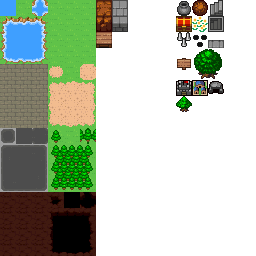
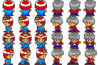

[WIP]TypeScriptでenchant.jsを使ってサンプルを作ってみる その8

# はじめに
TypeScriptでenchant.jsを開発するためのライブラリ「ets-framework」を作成しました。  
[https://github.com/kazenetu/enchantjs-typescript](https://github.com/kazenetu/enchantjs-typescript)  
「starter/use-framework/template/」を使ってサンプルプログラムを開発しています。

# 今回のゴール
[前回作成したマップ表示](http://kazenetu.exblog.jp/23110348/)にキャラクタを表示します。  
※Mapデータは[enchantMapEditor](https://github.com/wise9/enchantMapEditor)で作成したデータを利用します。  
※利用可能なGitHubPagesを用意しました。ご利用ください。  
  [http://kazenetu.github.io/enchantMapEditor/mapeditor.html](http://kazenetu.github.io/enchantMapEditor/mapeditor.html)  

##  前提
[ビルド環境の構築](http://kazenetu.exblog.jp/22812282/)を参照して、下記を実行してください。  
※バージョンが1.__1.2__ に更新されています。  
・ templateフォルダの展開  
・ ```npm install```の実行  

## ソースコード
[https://github.com/kazenetu/blog-reports/tree/master/reports/08-ETS-HowTo-08/template](https://github.com/kazenetu/blog-reports/tree/master/reports/08-ETS-HowTo-08/template)

# 開発環境
下記がインストールされている前提です。  
カッコ内は私の環境です。  
・Node.js（5.6.0）  
・npm(3.8.3)  

# 実装手順
1.template/assets/resources/ にマップグラフィック(map0.gif)を追加してください。  
※[enchant.js Image Materials](http://enchantjs.com/ja/image-materials/)の素材を使用しています。    


2.template/assets/resources/ に 表示させるグラフィック(3x4_chara.png)を追加してください。  


3.template/assets/data/ に[enchantMapEditor](https://github.com/wise9/enchantMapEditor)で作成し、「コード生成」ボタンでマップ作成コードをテキストに保存しておいてください。  
 ※利用可能なGitHubPagesを用意しました。ご利用ください。  
  [http://kazenetu.github.io/enchantMapEditor/mapeditor.html](http://kazenetu.github.io/enchantMapEditor/mapeditor.html)  

4.template/main.tsを開き、下記の実装をしてください。  
※処理を追加していないメソッドは除外しています。

``` typesctipt
class GameMain extends Rf.ETS.FrameWork.GameMain {
  private group: Rf.ETS.FrameWork.Group = null;

  private mapHeight: number = 0; //※1
  private mapWidth: number = 0; //※1
  private backgroundMap:Rf.ETS.FrameWork.ExMap = null; //※1
  private player: Rf.ETS.FrameWork.Character = null; //※1

  private touchPanel: Rf.ETS.FrameWork.Sprite = null; //※1
  private touchX: number = -1; //※1
  private touchY: number = -1; //※1
  private isTouch: boolean = false; //※1

  /**
   * 初期化イベント
   * @method
   * @name FrameWork.GameMain#onInitialize
   */
  protected onInitialize(): void { //※2
    //サイズを320x480に変更
    this.screenWidth = 480;
    this.screenHeight = 480;
  }

  /**
    * リソース設定イベント
    * @method
    * @name FrameWork.GameMain#resourceLoad
    */
  protected onResourceSetting(): void {
    this.resourceManager.SetResourcePath("./assets/");
    this.resourceManager.AddResourceName("mapImage", "resources/map0.gif");
    this.resourceManager.AddResourceName("charaImage", "resources/3x4_chara.png");
  }

  /**
   * ロードイベント
   * @method
   * @name FrameWork.GameMain#onLoad
   * @param {Object} parent - 親Group
   */
  protected onLoad(parent: enchant.Group): void { //※3
    //グループインスタンス作成
    this.group = new Rf.ETS.FrameWork.Group(parent); //※3.1
    this.group.y = 50;

    //背景用マップの読み込み
    this.backgroundMap = new Rf.ETS.FrameWork.ExMap(16, 16, this.group); //※3.2
    this.backgroundMap.FileName = this.resourceManager.GetResourceName("mapImage");
    //マップエディタから出力したloadDataメソッドを張り付ける//※3.3
    this.backgroundMap.LoadDatas([
    　　//enchant MapEditorのコード出力で表示したbackgroundMap.loadDataの第一パラメータ（二次元配列）
    ], [
      //enchant MapEditorのコード出力で表示したbackgroundMap.loadDataの第二パラメータ（二次元配列）
    ]);

    //マップ情報の設定 //※3.4
    this.mapHeight = this.backgroundMap.height / 16;
    this.mapWidth = this.backgroundMap.width / 16;
    this.backgroundMap.collisionData = [
      //enchant MapEditorのコード出力で表示したbackgroundMap.collisionData（二次元配列）
    ]；

    //キャラクタの設定 //※3.5
    this.player = new Rf.ETS.FrameWork.Character(32, 32, this.group);
    //イメージの設定(Rf.ETS.FrameWork.Sprite独自の機能)
    this.player.FileName = this.resourceManager.GetResourceName("charaImage");
    //その他の設定(Rf.ETS.FrameWork.Character独自の機能)
    this.player.charaIndex = 1;
    this.player.Dir = Rf.ETS.FrameWork.Direction.Down;
    this.player.AnimePattern = [0,1,0,2];
    this.player.AnimeWidth = 3;
    this.player.maxWaitCount =1;
    this.player.Init();

    this.player.x = 20 * 16;
    this.player.y = 24 * 16;

    //前景用マップの読み込み //※3.6
    let frontMap = new Rf.ETS.FrameWork.ExMap(16, 16, this.group);
    frontMap.FileName = this.resourceManager.GetResourceName("mapImage");
    //マップエディタから出力したloadDataメソッドを張り付ける
    frontMap.LoadData([
      //enchant MapEditorのコード出力で表示したbackgroundMap.loadDataの追加した第三パラメータ（二次元配列）
    ]);

    //タッチ用スプライトの追加 //※3.6
    this.touchPanel = new Rf.ETS.FrameWork.Sprite(this.mapWidth * 16, this.mapHeight * 16, this.group);
    this.touchPanel.touchEnabled = true;

    this.touchPanel.addEventListener(enchant.Event.TOUCH_START, (e: any) => {
      this.touchX = e.x;
      this.touchY = e.y;
      this.isTouch = true;
    });
    this.touchPanel.addEventListener(enchant.Event.TOUCH_MOVE, (e: any) => {
      this.touchX = e.x;
      this.touchY = e.y;
      this.isTouch = true;
    });
    this.touchPanel.addEventListener(enchant.Event.TOUCH_END, (e: any) => {
      this.isTouch = false;
    });
  }

  /**
   * 実行イベント
   * @method
   * @name FrameWork.GameMain#onRun
   */
  protected onRun(): void { //※4
    //表示位置の設定:マップの移動
    let centerX = this.screenWidth * 0.5;
    let centerY = this.screenHeight * 0.5;

    if (this.isTouch === true) {
      //表示位置の設定:マップの移動
      let addX = 0;
      let addY = 0;

      //中心位置との距離を求める
      let tempX = this.touchX - centerX;
      let tempY = this.touchY - centerY;
      let dir:Rf.ETS.FrameWork.Direction = this.player.Dir;

      if (Math.abs(tempX) < Math.abs(tempY)) { //※4.1
        //Yの距離のほうが値が大きい
        if (tempY < 0) {
          addY = -1;
          dir = Rf.ETS.FrameWork.Direction.Up;
        } else {
          addY = 1;
          dir = Rf.ETS.FrameWork.Direction.Down;
        }
      } else {
        //Xの距離のほうが値が大きい
        if (tempX < 0) {
          addX = -1;
          dir = Rf.ETS.FrameWork.Direction.Left;
        } else {
          addX = 1;
          dir = Rf.ETS.FrameWork.Direction.Right;
        }
      }
      if(this.player.Dir != dir){
        this.player.Dir = dir;
      }

      let hitTestX = this.player.x + addX * 16;
      let hitTestY = this.player.y + addY * 16 + 16;
      if(this.backgroundMap.hitTest(hitTestX,hitTestY) === false
        && this.backgroundMap.hitTest(hitTestX+16,hitTestY) === false){ //※4.2

        this.player.x += addX*16;
        this.player.y += addY*16;

        this.player.Run();
      }
    }

    this.group.x = -this.player.x + centerX; //※4.3
    if (this.group.x > 0) {
        this.group.x = 0;
    }
    if (this.group.x < -16 * this.mapWidth + this.screenWidth) {
        this.group.x = -16 * this.mapWidth + this.screenWidth;
    }

    this.group.y = -this.player.y + centerY; //※4.3
    if (this.group.y > 0) {
        this.group.y = 0;
    }
    if (this.group.y <= -16 * this.mapHeight + this.screenHeight) {
        this.group.y = -16 * this.mapHeight + this.screenHeight;
    }
  }
}
```
実装内容は以下のとおりです。  (__太字__ は前回からの修正・追記)
1. フィールドの定義  
 * mapHeight  
   マップの高さ(横スクロールの限界値)
 * mapWidth  
   マップの幅(縦スクロールの限界値)
 * __backgroundMap__  
   背景マップ（前回はローカル変数）
 * __player__  
   キャラクタオブジェクト
 * touchPanel  
   マップ移動用のSprite(透明レイヤー)
 * touchX  
   タッチX位置
 * touchY  
   タッチY位置
 * isTouch  
   タッチ状態(タッチ時にtrue、タッチ終了時にfalse)
1. onInitializeメソッド（一回だけ呼ばれる）  
 * 画面サイズを設定
1. onLoadメソッド（一回だけ呼ばれる）
 1. 「group」フィールドの生成  
 1. 背景用マップとしてExMapの生成  
 ※enchant MapEditorで作成したデータを扱うクラス
 1. マップエディタから出力した「loadDataメソッド」の引数を設定する
 1. マップの幅と高さ(スクロールの限界値)、__背景用マップの障害物情報(collisionData）を設定する__
 1. __キャラクタの生成__  
 ※背景マップと前景マップの間にキャラクタを表示する
 1. 前景用マップとしてExMapの生成  
 ※追加したレイヤー（例えば大きな木の上部）を設定する
 1. マップ移動用のSpriteの生成とイベントの設定  
 ※タッチ時にタッチ位置とタッチ状態をタッチ中(true) に設定  
 ※タッチ終了時にタッチ状態を未タッチ(false) に設定
1. onRunメソッド（描画ごとに呼ばれる）  
※全面的に変更されています
 1. __タッチ位置によってキャラクタ移動方向と向きを決める__
 1. __背景用マップの障害物情報を元に通行可能か確認し、通行可能であれば移動とアニメーションを行う__  
 ※マップは16*16単位、キャラクタは32*16のため、2マス分のチェックを行う
 1. __キャラクタが中心になるように「group」フィールドの位置情報を設定する__  
 ※マップ端までスクロールした場合はスクロールをストップする  

4.```npm run build``` または ```gulp default```でビルドを行います。

# おわりに
8回にわたってTypeScriptでenchant.jsを開発するためのライブラリ「ets-framework」の利用例を紹介しました。  
ブラウザゲームをTypeScriptで作成する場合の選択肢のひとつとなれば幸いです。

<br>
よかったらクリックしてください。  
<a href="http://it.blogmura.com/"></a>  
<a href="http://game.blogmura.com/game_work/"></a><br /><a href="http://game.blogmura.com/game_work/">にほんブログ村</a>
