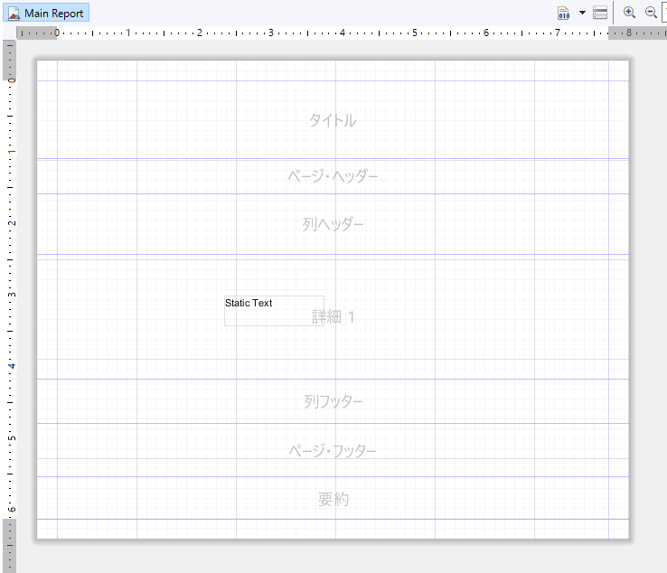

JasperReportsでPDFを出力する その2


# はじめに
JavaのWebアプリでPDFを出力するため、JasperReportsを使っています。
いくつか嵌ったポイントがあったので数回に分けて紹介したいと思います。  

今回は「Mavenでのライブラリ取得」で嵌ったポイントと対応を紹介します。  

# 開発環境
Eclipse(pleiades4.6 Neon)

# 嵌ったポイント
「Mavenでのライブラリ取得」でJasperReportsが取得できませんでした。

# 対応方法
1. pom.xmlのrepositoriesに書き加えます。  

  ``` xml
  <repositories>
      <repository>
          <id>jasperreports</id>
          <url>http://jasperreports.sourceforge.net/maven2</url>
      </repository>
  </repositories>
  ```  

1. pom.xmlのdependenciesにjasperreportsを追加します。  

  ``` xml
  <dependency>
      <groupId>net.sf.jasperreports</groupId>
      <artifactId>jasperreports</artifactId>
      <version>6.3.1</version>
  </dependency>
  ```

1. jrxmlファイルを作ります。
  
※StaticTextを張り付けたファイルです。

1. サンプルソースファイル  
jersey(JAX-RS)でPDFファイルを出力する例です。

  ``` Java
  JRDataSource dataSource = new JRBeanCollectionDataSource(Arrays.asList("dummy"));
  Map<String, Object> params = new HashMap<>();

  try {
      String filePath = this.getClass().getClassLoader().getResource(("sample.jrxml")).getPath();
      JasperReport report = JasperCompileManager.compileReport(filePath);

      return Response.ok(JasperRunManager.runReportToPdf(report, params, dataSource))
              .build();

  } catch (JRException e) {
      return Response.serverError().build();
  }
   ```

# おわりに
MavenでJasperReportsを取得して、簡単なPDFを出力することができました。  
次回はさらにバーコードやQRコードをPDF出力するときに嵌ったポイントを説明します。
